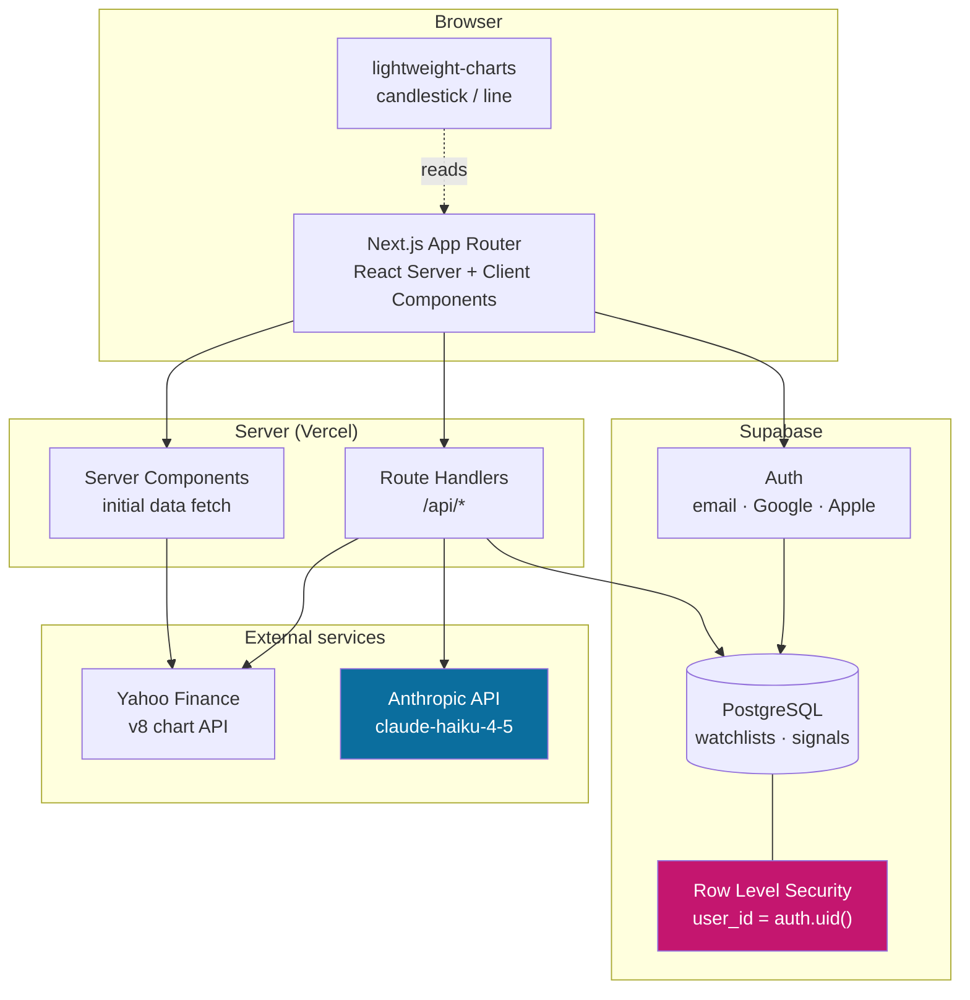

# BistAI

**AI-assisted market analysis for Borsa İstanbul equities.**
Real-time price data, technical charting, and plain-language signal explanations generated by a language model.

🔗 **Live:** [bistai.vercel.app](https://bistai.vercel.app) · 🇹🇷 [Türkçe README](./README.tr.md)

---

## The problem

Retail investors in Turkey have plenty of places to see a stock's price. What they don't have is anywhere that tells them **what the numbers mean**.

Open any brokerage app and you get RSI, MACD, moving averages, volume profiles — a wall of abbreviations with no interpretation. The information is technically present and practically useless to anyone who hasn't spent years learning to read it.

BistAI keeps the indicators and adds the missing layer: a short, readable explanation of what a given signal implies, written in Turkish, generated per stock.

> **Not investment advice.** BistAI is an educational and analytical tool. It does not recommend buying or selling any security.

---

## What it does

| Feature | Detail |
|---|---|
| **Real-time BIST data** | Price, volume and OHLC series pulled from Yahoo Finance's chart API |
| **Interactive charting** | Candlestick and line views via TradingView's `lightweight-charts` |
| **AI signal explanations** | Technical conditions passed to Claude, returned as plain-Turkish commentary |
| **Personal watchlist** | Per-user, persisted, isolated by row-level security |
| **Guest mode** | Browse without an account; AI assistant disabled, nothing persisted |
| **Auth** | Email/password, Google and Apple OAuth via Supabase |

---

## Architecture



**The key boundary:** the browser never talks to Yahoo Finance or Anthropic directly. Both run behind route handlers, so no third-party key is ever shipped to the client.

---

## Technical decisions

These are the choices that took the longest, and why they went the way they did.

### API keys never reach the browser

The obvious implementation — call the Anthropic API from a client component — leaks the key to anyone who opens DevTools. Every model call goes through a server route handler instead. `ANTHROPIC_API_KEY` has no `NEXT_PUBLIC_` prefix, which means Next.js will refuse to bundle it into client code even by accident.

### Row-level security instead of application-level filtering

Watchlists are private. The naive approach filters by user in the query (`where user_id = ...`) and trusts every code path to remember. One forgotten `where` clause leaks every user's data.

Instead the policy lives in the database:

```sql
create policy "own_watchlist" on watchlists
  for all using (auth.uid() = user_id);
```

Now a query that forgets to filter returns zero rows rather than everyone's rows. The failure mode is "broken", not "breached" — which is the correct direction for a security bug to fail.

### TradingView lightweight-charts over a custom renderer

Financial charts look simple and are not: crosshairs, time-axis gaps for non-trading hours, log scales, responsive redraw. `lightweight-charts` handles all of it in ~40 KB gzipped. Writing this by hand would have cost a week and produced something worse.

### A small, fast model — deliberately

Generating a two-sentence explanation of an RSI reading does not require deep reasoning. Using a Haiku-class model (`claude-haiku-4-5`) keeps latency low and cost per explanation negligible. The prompt does the heavy lifting; the model doesn't need to.

### Server components for the first paint

Stock pages are read far more often than they're interacted with. Fetching initial price data in a server component means the user sees real numbers on first paint instead of a loading skeleton, and search engines see actual content.

---

## Stack

- **Framework** — Next.js 14 (App Router), TypeScript
- **UI** — Tailwind CSS, shadcn/ui
- **Charts** — TradingView `lightweight-charts`
- **Data** — Yahoo Finance v8 chart API
- **AI** — Anthropic API (`claude-haiku-4-5`)
- **Backend** — Supabase (PostgreSQL, Auth, Row Level Security)
- **Hosting** — Vercel

---

## Running locally

```bash
git clone https://github.com/Doguserkivac09/BistAi.git
cd BistAi
npm install
```

Create `.env.local`:

```bash
NEXT_PUBLIC_SUPABASE_URL=your-project-url
NEXT_PUBLIC_SUPABASE_ANON_KEY=your-anon-key
ANTHROPIC_API_KEY=your-api-key
NEXT_PUBLIC_APP_URL=http://localhost:3000
```

Apply the database schema — this creates the tables **and** their RLS policies. The app will not work correctly without the policies:

```bash
psql "$SUPABASE_DB_URL" -f supabase/schema.sql
```

Then:

```bash
npm run dev
```

Open http://localhost:3000.

### Enabling guest mode

Guest mode uses Supabase anonymous sign-in, which is **off by default** on new projects. Turn it on in the Supabase dashboard under **Authentication → Providers → Anonymous sign-ins**, or the guest button returns `422`.

---

## Project layout

```
app/
  (auth)/          sign-in, sign-up, callback routes
  api/             route handlers — market data, AI explanations
  stocks/[symbol]/ stock detail page (server component)
components/
  charts/          lightweight-charts wrappers
  ui/              shadcn/ui primitives
lib/
  supabase/        browser and server clients
  market/          Yahoo Finance fetch + normalisation
supabase/
  schema.sql       tables, indexes, RLS policies
```

---

## Known limitations

Stated plainly, because pretending they don't exist helps nobody:

- **Data is delayed**, not tick-by-tick. Yahoo Finance's public endpoint is not a real-time market feed and shouldn't be treated as one.
- **No rate limiting** on the AI explanation route yet. Fine for current traffic, would need a per-user quota before opening up.
- **Turkish only.** The interface and generated explanations are Turkish; there is no English locale.
- **Explanations are generated, not audited.** The model describes what the indicators show. It can be wrong, and it is not a financial adviser.

---

## Roadmap

- [ ] Rate limiting and per-user quotas on the AI route
- [ ] Playwright end-to-end coverage for auth and watchlist flows
- [ ] Price alerts
- [ ] English locale

---

## License

MIT
