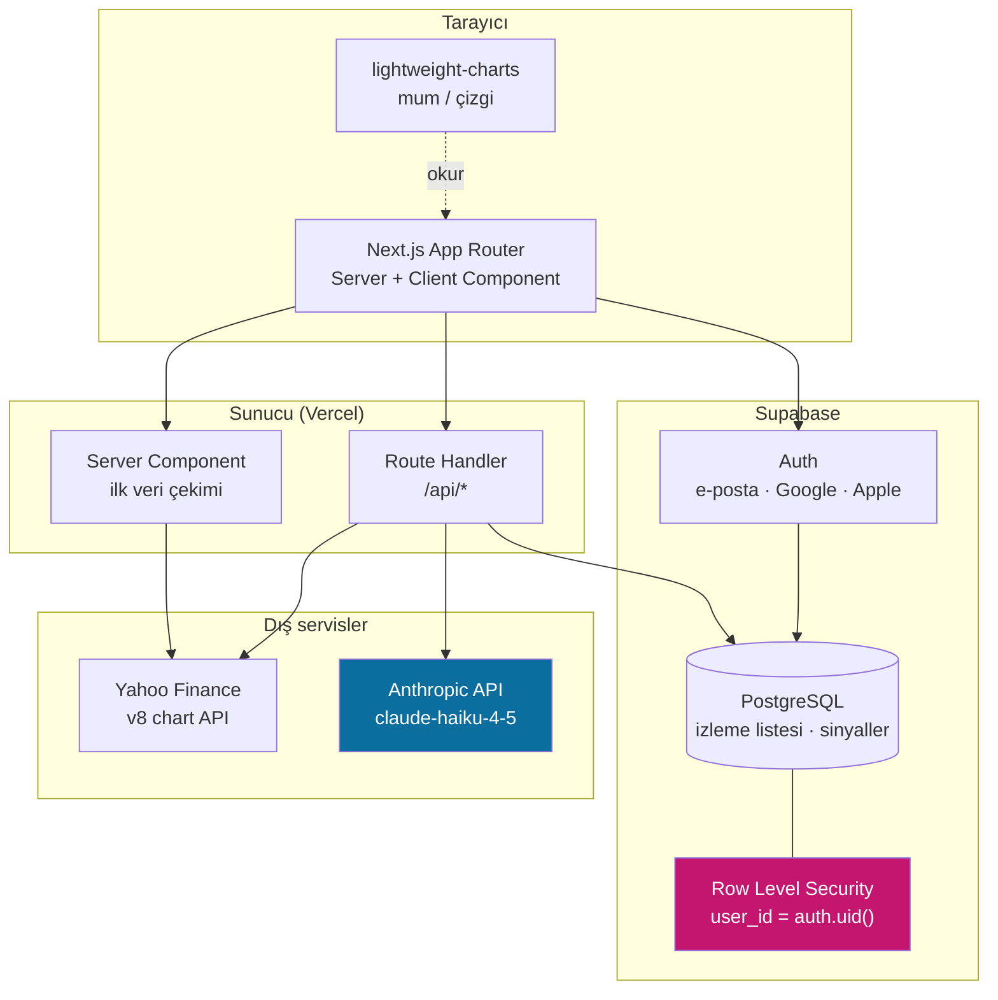

# BistAI

**Borsa İstanbul hisseleri için yapay zekâ destekli piyasa analizi.**
Gerçek zamanlı fiyat verisi, teknik grafik ve dil modeliyle üretilen sade Türkçe sinyal açıklamaları.

🔗 **Canlı:** [bistai.vercel.app](https://bistai.vercel.app) · 🇬🇧 [English README](./README.md)

---

## Problem

Türkiye'deki bireysel yatırımcının bir hissenin fiyatını göreceği yer çok. Olmayan şey, **bu rakamların ne anlama geldiğini** söyleyen yer.

Herhangi bir aracı kurum uygulamasını açın: RSI, MACD, hareketli ortalamalar, hacim profilleri — yorumu olmayan bir kısaltma duvarı. Bilgi teknik olarak orada duruyor ama okumayı yıllar içinde öğrenmemiş biri için pratikte kullanışsız.

BistAI göstergeleri kaldırmıyor, eksik katmanı ekliyor: bir sinyalin ne ima ettiğini anlatan, hisse bazında üretilen kısa ve okunabilir bir Türkçe açıklama.

> **Yatırım tavsiyesi değildir.** BistAI eğitim ve analiz amaçlı bir araçtır. Hiçbir menkul kıymet için alım veya satım önerisinde bulunmaz.

---

## Ne yapıyor

| Özellik | Detay |
|---|---|
| **Gerçek zamanlı BIST verisi** | Yahoo Finance grafik API'sinden fiyat, hacim ve OHLC serisi |
| **Etkileşimli grafik** | TradingView `lightweight-charts` ile mum ve çizgi görünümü |
| **AI sinyal açıklamaları** | Teknik koşullar modele iletiliyor, sade Türkçe yorum olarak dönüyor |
| **Kişisel izleme listesi** | Kullanıcıya özel, kalıcı, satır bazlı güvenlikle izole |
| **Misafir modu** | Hesapsız gezinme; AI asistan kapalı, hiçbir şey kaydedilmiyor |
| **Kimlik doğrulama** | Supabase üzerinden e-posta/şifre, Google ve Apple |

---

## Mimari



**Kritik sınır:** tarayıcı hiçbir zaman Yahoo Finance veya Anthropic ile doğrudan konuşmuyor. İkisi de route handler'ların arkasında çalışıyor, yani hiçbir üçüncü taraf anahtarı istemciye inmiyor.

---

## Teknik kararlar

En uzun düşündüğüm kararlar ve neden öyle sonuçlandıkları.

### API anahtarları tarayıcıya hiç inmiyor

Akla gelen ilk çözüm — Anthropic API'sini client component'ten çağırmak — anahtarı DevTools açan herkese veriyor. Bunun yerine bütün model çağrıları sunucu tarafındaki route handler'lardan geçiyor. `ANTHROPIC_API_KEY` değişkeninin `NEXT_PUBLIC_` öneki yok; bu sayede Next.js onu yanlışlıkla bile istemci paketine koymayı reddediyor.

### Uygulama seviyesinde filtre yerine satır bazlı güvenlik

İzleme listeleri kişiye özel. Naif yaklaşım sorguda kullanıcıya göre filtrelemek (`where user_id = ...`) ve her kod yolunun bunu unutmayacağına güvenmek. Tek bir unutulmuş `where` bütün kullanıcıların verisini sızdırır.

Bunun yerine politika veritabanında duruyor:

```sql
create policy "own_watchlist" on watchlists
  for all using (auth.uid() = user_id);
```

Artık filtrelemeyi unutan bir sorgu herkesin satırlarını değil, sıfır satır döndürüyor. Hata durumu "sızdırdı" değil "çalışmadı" oluyor — bir güvenlik hatasının başarısız olması gereken yön budur.

### Kendi grafik motorum yerine TradingView lightweight-charts

Finansal grafikler basit görünür, değildir: nişangâh, işlem dışı saatler için zaman ekseni boşlukları, logaritmik ölçek, responsive yeniden çizim. `lightweight-charts` bunların hepsini ~40 KB (gzip) içinde çözüyor. Elle yazmak bir haftaya mal olur ve daha kötüsünü üretirdi.

### Bilinçli olarak küçük ve hızlı bir model

Bir RSI değerini iki cümleyle açıklamak derin akıl yürütme gerektirmiyor. Haiku sınıfı bir model (`claude-haiku-4-5`) gecikmeyi düşük, açıklama başına maliyeti ihmal edilebilir tutuyor. Asıl işi prompt yapıyor; modelin ağır olmasına gerek yok.

### İlk boyama için server component

Hisse sayfaları etkileşimden çok okunuyor. İlk fiyat verisini server component'te çekmek, kullanıcının iskelet yerine gerçek rakamları ilk boyamada görmesini ve arama motorlarının gerçek içerik görmesini sağlıyor.

---

## Teknolojiler

- **Çatı** — Next.js 14 (App Router), TypeScript
- **Arayüz** — Tailwind CSS, shadcn/ui
- **Grafik** — TradingView `lightweight-charts`
- **Veri** — Yahoo Finance v8 chart API
- **AI** — Anthropic API (`claude-haiku-4-5`)
- **Sunucu tarafı** — Supabase (PostgreSQL, Auth, Row Level Security)
- **Barındırma** — Vercel

---

## Yerelde çalıştırma

```bash
git clone https://github.com/Doguserkivac09/BistAi.git
cd BistAi
npm install
```

`.env.local` dosyasını oluşturun:

```bash
NEXT_PUBLIC_SUPABASE_URL=proje-adresiniz
NEXT_PUBLIC_SUPABASE_ANON_KEY=anon-anahtariniz
ANTHROPIC_API_KEY=api-anahtariniz
NEXT_PUBLIC_APP_URL=http://localhost:3000
```

Veritabanı şemasını uygulayın — bu komut tabloları **ve** RLS politikalarını oluşturur. Politikalar olmadan uygulama doğru çalışmaz:

```bash
psql "$SUPABASE_DB_URL" -f supabase/schema.sql
```

Ardından:

```bash
npm run dev
```

http://localhost:3000 adresini açın.

### Misafir modunu açmak

Misafir modu Supabase anonim girişini kullanıyor ve bu ayar yeni projelerde **kapalı geliyor**. Supabase panelinde **Authentication → Providers → Anonymous sign-ins** altından açın; yoksa misafir butonu `422` döner.

---

## Proje yapısı

```
app/
  (auth)/          giriş, kayıt, callback route'ları
  api/             route handler'lar — piyasa verisi, AI açıklamaları
  stocks/[symbol]/ hisse detay sayfası (server component)
components/
  charts/          lightweight-charts sarmalayıcıları
  ui/              shadcn/ui bileşenleri
lib/
  supabase/        tarayıcı ve sunucu istemcileri
  market/          Yahoo Finance çekimi ve normalizasyonu
supabase/
  schema.sql       tablolar, indeksler, RLS politikaları
```

---

## Bilinen sınırlamalar

Açıkça yazıyorum, çünkü yokmuş gibi davranmak kimseye yaramaz:

- **Veri gecikmelidir**, tik bazlı değildir. Yahoo Finance'in açık uç noktası gerçek zamanlı bir piyasa beslemesi değildir ve öyle muamele görmemelidir.
- **AI açıklama route'unda henüz hız sınırlaması yok.** Mevcut trafik için sorun değil, açılmadan önce kullanıcı başına kota gerekir.
- **Yalnızca Türkçe.** Arayüz ve üretilen açıklamalar Türkçedir; İngilizce yerelleştirme yoktur.
- **Açıklamalar üretilir, denetlenmez.** Model göstergelerin ne gösterdiğini anlatır. Yanılabilir ve finansal danışman değildir.

---

## Yol haritası

- [ ] AI route'unda hız sınırlaması ve kullanıcı başına kota
- [ ] Giriş ve izleme listesi akışları için Playwright uçtan uca testleri
- [ ] Fiyat alarmları
- [ ] İngilizce yerelleştirme

---

## Lisans

MIT
